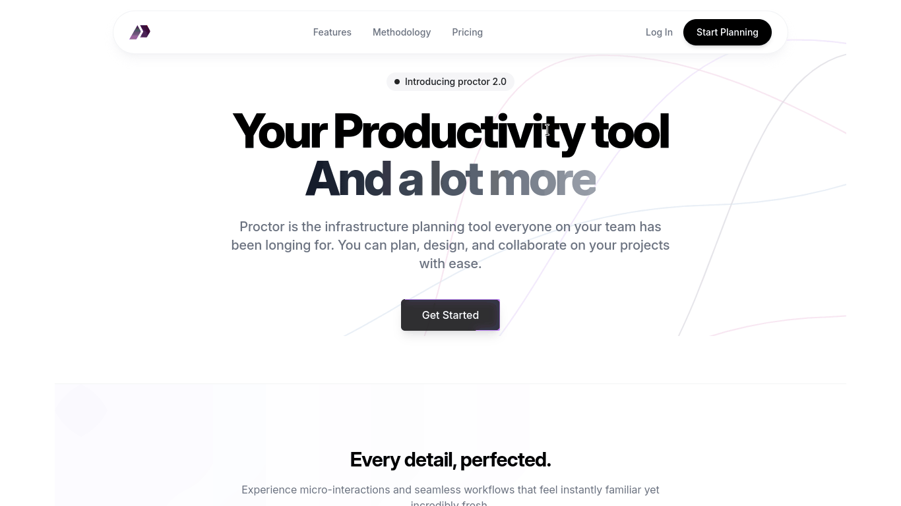
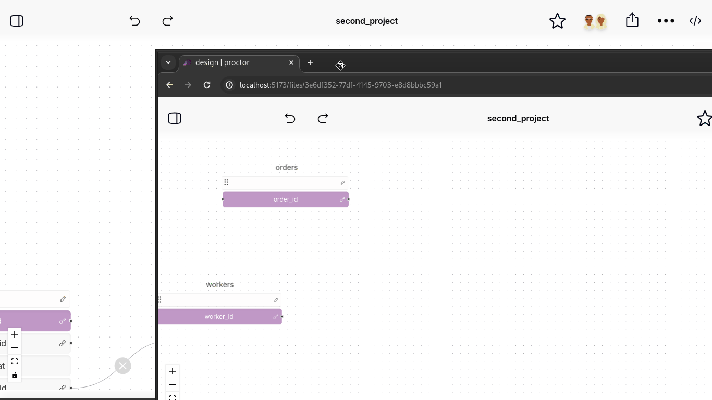

# Proctor

<div align="center">
  
  <h3>A Collaborative Visual Schema Designer</h3>
  <p>Emit production-ready database schemas directly from UI interactions.</p>
</div>

---

## 🎯 Overall Goal

Proctor is a node-based visual editor designed to collapse the gap between **data modeling** and **implementation**. Instead of treating ER diagrams as static documentation, Proctor treats UI interactions as the **source of truth**.

The tool allows developers to visually define tables, fields, and relationships, and immediately emit **Drizzle ORM** or **SQL** schema definitions. This ensures that your model and your code are always in sync.

---

## 📽️ Visual Demos

### Collaborative Modeling

*Real-time collaboration and workspace setup.*

### Schema Design in Action

*Building tables and defining relationships visually.*

---

## 🚀 Key Features (Client v1)

- **Node-Based Editor**: Powered by **XYFlow (React Flow)** for a smooth, interactive graphing experience.
- **Real-Time Collaboration**: Built on **Yjs** and **WebSockets** for seamless multi-player editing. See markers and updates from teammates instantly.
- **Smart Schema Emission**: A dedicated output pane that generates schema definitions (Drizzle/SQL) on the fly as you modify the graph.
- **Relationship Modeling**: Support for One-to-One, One-to-Many, and Many-to-Many relationships with automatic foreign key inference.
- **Integrated Chat**: Direct communication within the workspace to discuss architectural decisions.
- **Workspace Management**: Auth-protected workspaces and documents with persistence.
- **Premium UI/UX**: Dark-themed, high-contrast design using **Tailwind CSS**, **Radix UI**, and smooth animations via **Framer Motion** and **AOS**.

---

## 🛠️ Tech Stack

- **Framework**: [Remix.js](https://remix.run/) (Vite-based)
- **Graphing Engine**: [XYFlow](https://reactflow.dev/)
- **State Management**: [Redux Toolkit](https://redux-toolkit.js.org/) & [Redux Persist](https://github.com/rt2zz/redux-persist)
- **Connectivity**: [Socket.io](https://socket.io/)
- **Collaboration**: [Yjs CRDTs](https://yjs.dev/)
- **Styling**: [Tailwind CSS](https://tailwindcss.com/)
- **UI Components**: [Radix UI](https://www.radix-ui.com/)
- **Animations**: [Framer Motion](https://www.framer.com/motion/) & [AOS](https://michalsnik.github.io/aos/)

---

## 📁 Project Structure

```text
client/v1/
├── app/
│   ├── components/       # Core UI components (Canvas, Header, Forms)
│   ├── contexts/         # React Contexts (Collaboration, Auth)
│   ├── hooks/            # Custom React hooks (Sockets, Events)
│   ├── reducers/         # Redux slices (Workspace, Chat, Auth)
│   ├── routes/           # Remix routes (Landing, Auth, Workspace)
│   └── store.ts          # Redux store configuration
├── public/
│   ├── images/           # GIFs and static assets
│   └── icons/            # App icons
└── tailwind.config.ts    # Design tokens and theme
```

---

## 🛠️ Getting Started

### Prerequisites
- Node.js >= 20.0.0
- Yarn or NPM

### Installation
```bash
cd client/v1
yarn install
```

### Development
```bash
yarn dev
```

### Build
```bash
yarn build
yarn start
```

---

## 📝 License
Proctor is private software. All rights reserved.
